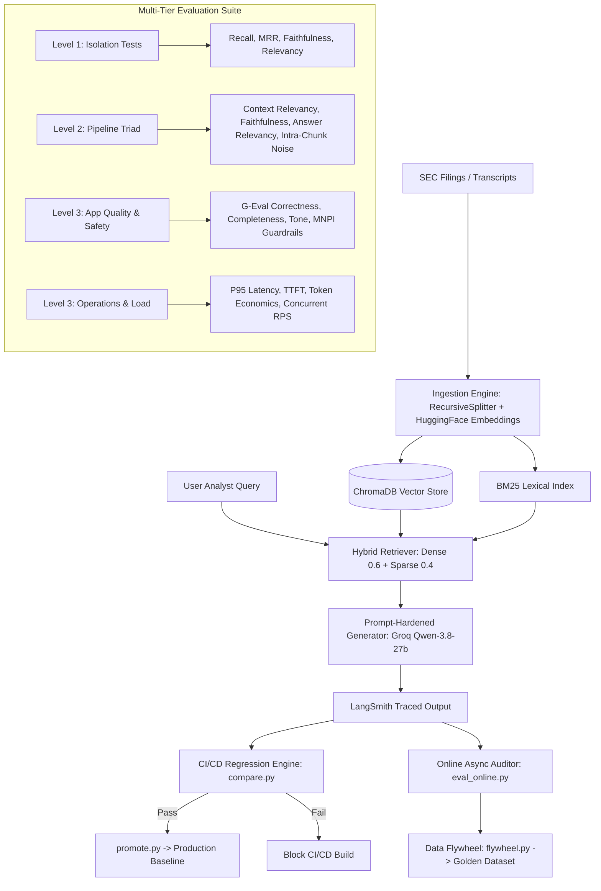

# FinSecure RAG: Enterprise SEC Evaluation & Observability Platform

[](https://github.com)
[](https://github.com/confident-ai/deepeval)
[](https://groq.com)
[](https://smith.langchain.com)

**FinSecure RAG** is a production-grade, enterprise financial retrieval-augmented generation (RAG) assistant and automated multi-tier evaluation system built for analyzing SEC 10-K & Quarterly Earnings disclosures (NVIDIA, Apple, Microsoft).

This project implements the full **3-Tier RAG Evaluation Architecture** (covering all 8 sessions of production RAG evaluation methodologies) plus advanced real-world production engineering practices:
1. **Component-in-Isolation Evaluation** (Retriever & Generator separately)
2. **End-to-End Pipeline Evaluation** (The RAG Triad + Intra-chunk noise diagnosis)
3. **Application Quality & Guardrails** (G-Eval Correctness, Completeness, Professional Tone, MNPI leakage prevention, Red-teaming)
4. **Operations & Economics Benchmarking** (P50/P95/P99 Latency, Streaming TTFT, Token Pricing, Concurrency Stress Test)
5. **CI/CD Regression Prevention Engine** (Statistical noise margins $\pm 2\sigma$, PR gating, Automated Promotion)
6. **Online Observability & Data Flywheel** (LangSmith tracing, Async live auditing, Curated trace-to-golden synthesis)

---

## 🏛️ Architecture Overview



---

## 📊 Comprehensive 3-Tier Metric Coverage

| Tier | Evaluation Focus | Metrics Implemented | Tools / Methods |
| :--- | :--- | :--- | :--- |
| **Level 1** | **Retriever in Isolation** | • Context Recall (91.67%)<br>• Precision@1 & Precision@3 (100%)<br>• Mean Reciprocal Rank - MRR (1.00) | `rank_bm25`, `HuggingFaceEmbeddings`, Keyword Hit Profiler |
| **Level 1** | **Generator in Isolation** | • Generator Faithfulness (100%)<br>• Generator Answer Relevancy (100%) | `DeepEval`, `GroqJudgeModel` |
| **Level 2** | **Pipeline RAG Triad** | • Contextual Relevancy (31.54%)<br>• Pipeline Faithfulness (100%)<br>• Pipeline Answer Relevancy (90%)<br>• Intra-Chunk Noise Ratio (77%) | `ContextualRelevancyMetric`, Sentence Noise Profiler |
| **Level 3** | **Application Quality** | • G-Eval Financial Correctness<br>• G-Eval Answer Completeness<br>• G-Eval Professional Tone (100%) | `GEval` Custom Chain-of-Thought Rubrics |
| **Level 3** | **Application Safety** | • Toxicity Metric (100% clean)<br>• Guardrail Refusal Rate (100%)<br>• MNPI Leakage Rate (0.0% zero-tolerance) | `ToxicityMetric`, Red-Teaming Adversarial Probes |
| **Level 3** | **Operations & Economics** | • P50/P95/P99 Latency Profiling<br>• Time-to-First-Token (TTFT streaming)<br>• Cost per 1,000 queries ($0.46)<br>• Error Rate (0.0%) | Token Streaming Profiler, Token Economics Engine |
| **Level 3** | **Concurrency Stress Test** | • Multi-threaded Worker Requests Per Second (RPS = 3.45 req/s) | `ThreadPoolExecutor` Load Benchmarker |

---

## 🚀 Quickstart & Setup

### 1. Installation
Clone the repository and install dependencies:
```bash
git clone https://github.com/your-username/finsecure-rag.git
cd finsecure-rag
pip install -r requirements.txt
```

### 2. Environment Variables
Create a `.env` file in the root directory:
```env
GROQ_API_KEY=your_groq_api_key_here
LANGCHAIN_API_KEY=your_langsmith_api_key_here  # Optional for LangSmith cloud tracing
LANGCHAIN_TRACING_V2=true
LANGCHAIN_PROJECT=finsecure-rag
```

### 3. Ingestion & Database Population
Split SEC transcripts into 600-character chunks and build ChromaDB + BM25 indices:
```bash
python -m src.ingestion
```

---

## 🧪 Running the Evaluation Suite & CI/CD Engine

### Run All 7 Eval Modules & Create Baseline
```bash
python -m evals.run_suite --output baselines/baseline.json
```

### CI/CD Regression Comparison
Compare candidate test runs against the production baseline with strict statistical margin enforcement:
```bash
# Verify passing build:
python -m evals.compare --baseline baselines/baseline.json --candidate baselines/candidate_passed.json

# Test blocking build on critical regression (e.g., faithfulness drop or MNPI leak):
python -m evals.compare --baseline baselines/baseline.json --candidate baselines/candidate_failed.json
```

### Promote Candidate to Baseline
```bash
python -m evals.promote --candidate baselines/candidate_passed.json --baseline baselines/baseline.json
```

### Run Online Telemetry & Autonomous Data Flywheel
```bash
# 1. Simulate live production auditing in background:
python -m evals.eval_online

# 2. Mine flagged traces to synthesize new golden test cases:
python -m evals.flywheel
```

---

## 💻 Streamlit UI

Launch the interactive enterprise dashboard:
```bash
streamlit run app/streamlit_app.py
```
**Dashboard Features:**
- **Interactive Analyst Assistant**: Live query interface with retrieval inspection and latency profiling.
- **3-Tier Telemetry Dashboard**: Real-time scorecards across component, pipeline, quality, safety, and operations.
- **CI/CD Regression Gatekeeper**: Instant side-by-side diff matrix between candidate and baseline runs.
- **Data Flywheel Monitor**: Inspect online production audits and newly generated golden test cases.

---

## 🛡️ Enterprise Security & Guardrails
- **Zero-Tolerance MNPI Guard**: Negative constraints prevent the LLM from speculating on unreleased quarterly numbers or confidential executive remarks.
- **Adversarial Injection Defense**: Rebuffs attempts to override financial analyst system prompts.
- **PII Scrubbing**: Strictly declines inquiries into personal non-public executive data.
